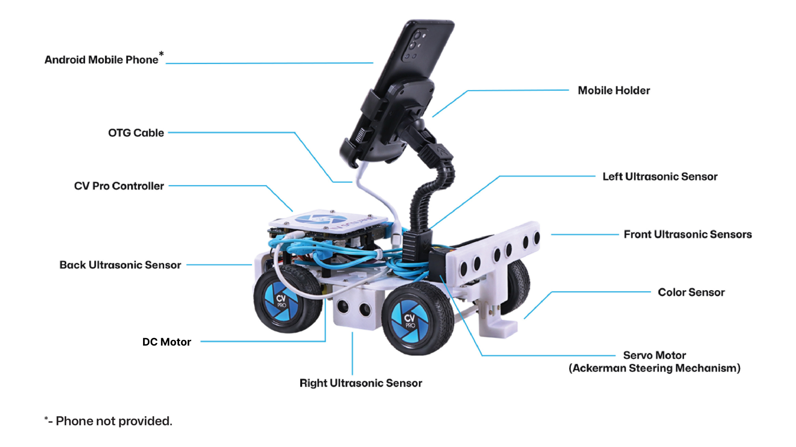
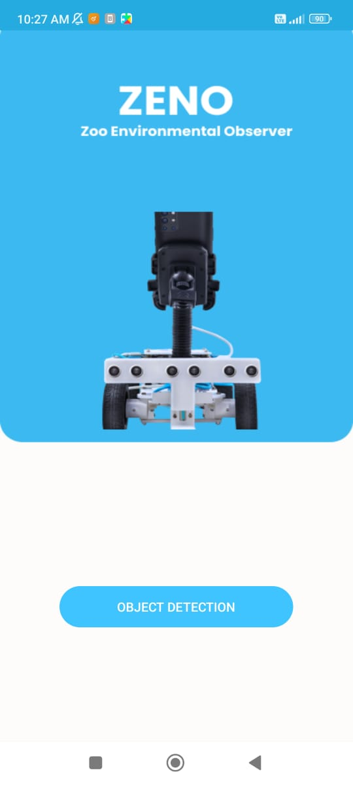
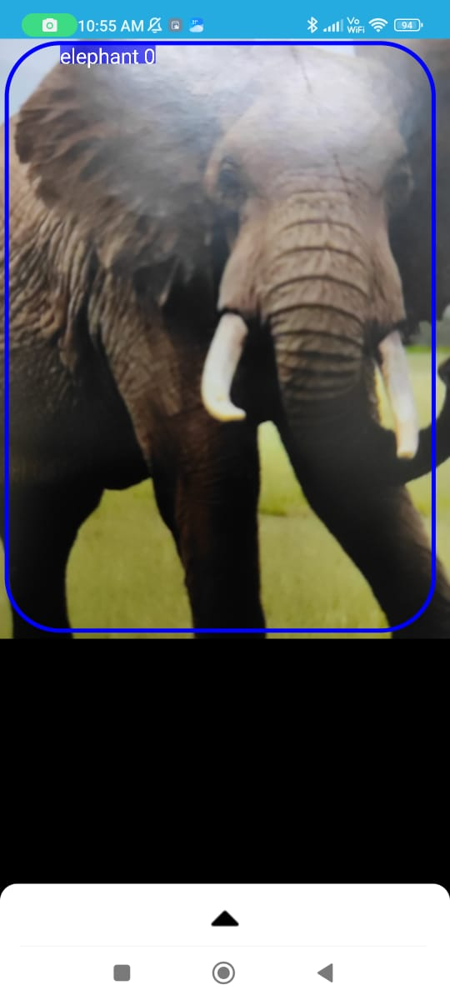
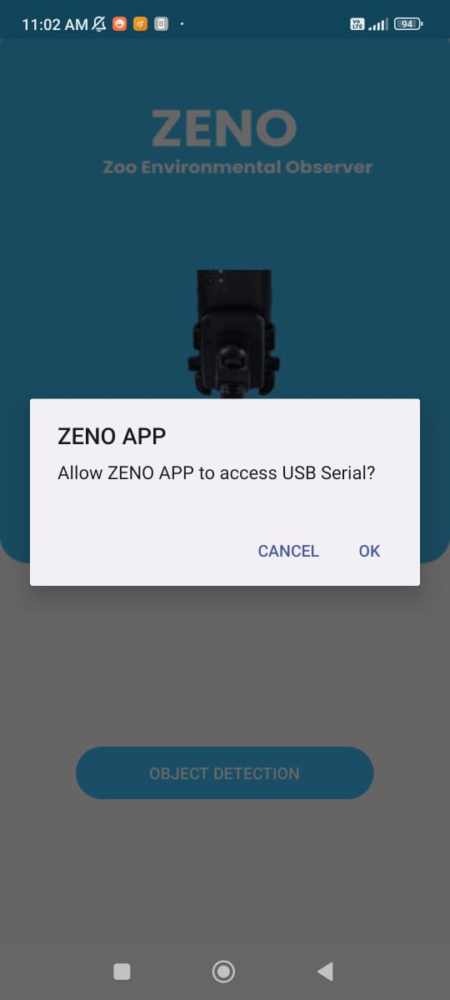
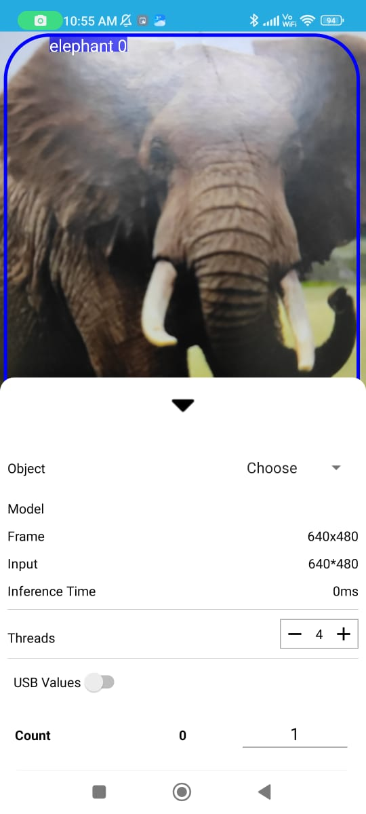
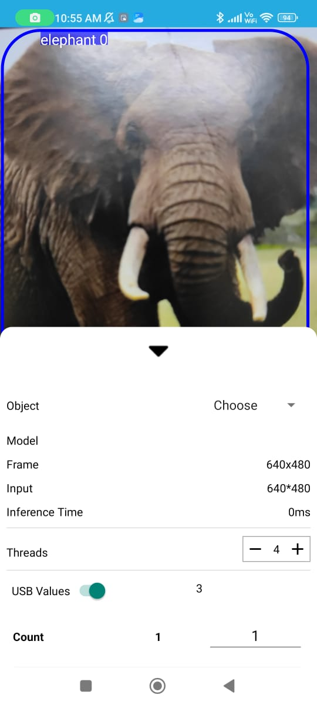
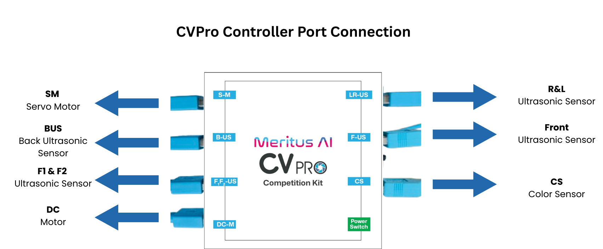

# 🐾 Zeno (The Zoo Safari Robot) using CVPro Kit

## 🤖 About Zeno robot

**Zeno** is an intelligent, AI-powered robot designed specifically for the Zoo Safari Application and educational robotics. Built using the advanced CVPro Competition Kit, Zeno combines computer vision, sensor fusion, and autonomous navigation to create an engaging and interactive robotic experience.

### 🎯 Key Functions of Zeno:

- **🦁 Animal Recognition**: Uses computer vision to identify and classify different animals (Zebra, Elephant, Giraffe, Hunter) placed on the competition mat
- **🧭 Autonomous Navigation**: Navigates the 10×10 ft Zoo Safari mat using ultrasonic sensors and color detection
- **📱 Mobile Integration**: Connects with Android devices via USB OTG for real-time image processing and control
- **🎮 Interactive Control**: Features push-button activation and RGB LED status indicators
- **🔄 Obstacle Avoidance**: Equipped with 6 ultrasonic sensors for safe movement and collision prevention
- **⚡ Competition Ready**: Designed for robotics competitions with quick setup and reliable performance

This project focuses on Zeno robot built using the CVPro Competition Kit. All instructions, hardware, and software details below are oriented toward the Zoo Safari application.

    

---

## 🚀 Quick Start: Zeno robot

1. Assemble the CVPro robot chassis and electronics. See the Robot Construction Guide below.
2. Install Arduino IDE and required libraries (ESP32 2.0.17, NewPing 1.9.7, FastLED 3.7.0, ESP32Servo 1.2.1, Adafruit TCS34725 1.4.4).
3. Download and install the Android Zeno app (APK link provided below).
4. Connect your phone to the CVPro controller using a Type‑C OTG cable and grant permissions.
5. Upload the Zeno_firmware to the CVPro bot in Arduino IDE (board: DOIT ESP32 DEVKIT V1).
6. Prepare the animal cards (Zebra, Elephant, Giraffe, Hunter) and place the 10 × 10 ft Zoo Safari mat.
7. Start the app, select 'Object Detection', and run the robot.

    

---

## 🛠️ Hardware for Zeno robot

This robust kit includes all essential hardware components to build and operate a fully functional AI-powered robot:

1. **CVPro Controller (ESP32-based)**  
   A high-performance microcontroller that supports Wi-Fi and Bluetooth—ideal for real-time AI applications and sensor integration.

2. **Servo Motor with Ackerman Steering System**  
   Ensures precise directional control, emulating the steering mechanism of real-world vehicles for efficient turns.

3. **DC Motor**  
   Powers the bot’s forward and backward motion.

4. **Color Sensor**  
   Detects coloured paths or zones on the ground—useful for line-following or zone-based tasks.

5. **Six Ultrasonic Sensors**

   - **Front (3):** Detect obstacles ahead with increased accuracy.
   - **Rear (1):** Enables reverse movement safety.
   - **Left (1) and Right (1):** For lateral obstacle detection and wall-following tasks.

6. **Push Button**  
   A simple interface to start the robot’s programmed tasks—ideal for quick competition launches.

7. **Programmable RGB LED**  
   Visual feedback through color coding—useful for status indication, error alerts, and task confirmation.

8. **Mobile Phone Holder and OTG Cable**  
   Designed to securely hold a mobile device for image processing, remote control, or augmented vision applications.

---

## 🔧 Robot Construction Guide

Please click on the link to view the tutorial video on how to assemble the CV Pro Competition Kit: [Click Here!](https://vimeo.com/1064673881/494deecb76?share=copy)

---

## 💻 Software for Zeno robot

The CVPro kit provides the following software for Zeno robot:

1. **Arduino IDE with Required Libraries:**

   - Easy-to-use programming environment.
   - Compatible libraries for sensor interfacing, motor control, and AI features like object detection.

2. **Android Mobile App for Zeno robot:**

   - An app designed specifically for Zeno robot application.
   - It can identify animals and hunters.
   - Additionally, it supports custom object detection and image classification capabilities.

   ### 📱 You can download the APK from this [Drive Link](https://drive.google.com/file/d/1pT_TmvDnXAngSOnujgTd6fQjQ7e5thOa/view?usp=sharing) ⬇️

---

## 📱 About the Zeno robot App

Follow these steps to use the app:

1. **Open the app.**

   

2. **Connect your phone to the CVPro controller using a Type‑C OTG cable.**

   

3. **When prompted, tap Allow to grant USB permissions and click the 'Object Detection' Button**

   

4. **Swipe up to access controls.**

   

5. **Turn on the USB value toggle.**

   

6. **The app is ready to use.**

---

## 🦁 Zoo Safari requirements

1. Prepare the animal cards (size: **210 mm × 99 mm**):
   - Zebra
   - Elephant
   - Giraffe
   - Hunter
2. Place and use the official Zoo Safari mat. Ensure the mat size is **10 × 10 ft** and laid flat, with good lighting.
   - Download the Zoo Safari mat: [Download Mat (dummy link)](https://example.com/zoo-safari-mat)
3. Upload the Zeno_firmware code to the bot using Arduino IDE:
   - Open the Zeno_firmware in Arduino IDE.
   - Use the same board and port settings as in the setup steps.
   - Click the Upload button to flash the code to the CVPro bot.

---

## 🔧 Technical Notes

### About the CVPro Controller:

1. **Charging and Discharging:**  
   Charging is enabled only when the robot is powered OFF to ensure safety and optimal charging efficiency. Use the USB Type-C port for charging. You can either charge the robot using a 5V 1A adapter or via a laptop USB port.

2. **Charging Indicators:**

   - A **green LED** indicates that the robot is fully charged (only visible when the bot is OFF).
   - A **red LED** indicates that the battery is currently charging.
   - Ensure the robot can run for approximately **50 minutes** after a full charge.

3. **Battery Specification:**  
   Equipped with a 3.7V, 3200mAh Li-ion single-cell battery for extended operation time.

4. **Power Module:**  
   Supplies stable power to the controller board, sensors, and motors.

5. **Motor Driver:**  
   Dedicated module for controlling the DC and servo motors with precision.

6. **ESP32 Microcontroller:**  
   A powerful dual-core microcontroller that supports both wired (via Type-C port) and wireless communication (Wi-Fi and Bluetooth). It handles sensor inputs, motor control, and AI-based algorithms.

---

### Servo Angle Configuration:

1. The servo in the kit is calibrated with a **centre angle of 100 degrees**.
2. When adjusting the servo, ensure the angle remains within a **±20° range from the centre—between 80° and 120°**.  
   Operating beyond these limits may cause mechanical strain or damage to the servo.

---

### Pinouts for CVPro Controller

| Function                             | Port Type | Port No | GPIO Pins                  |
| ------------------------------------ | --------- | ------- | -------------------------- |
| Motor (Battery Operated Motor)       | USB 3.0   | 1       | 32, 33                     |
| F1US & F2US (Front 1 & 2 Ultrasonic) | USB 3.0   | 2       | F1 - 16,14 / F2 - 25,26    |
| BUS (Back Ultrasonic Sensor)         | USB 3.0   | 3       | 17, 19                     |
| SM (Servo Motor)                     | USB 3.0   | 4       | 27                         |
| RUS & LUS (Right & Left Ultrasonic)  | USB 3.0   | 5       | Right - 2,23 / Left - 5,18 |
| FUS (Front Ultrasonic Sensor)        | USB 2.0   | 6       | 12, 4                      |
| CS (Color Sensor)                    | USB 2.0   | 7       | 22, 21                     |
| RGB LED                              | -         | -       | 15                         |
| NSLEEP For Motor                     | -         | -       | 13                         |
| Battery Voltage Reading              | -         | -       | 39                         |
| DPDT Push Button                     | -         | -       | 34                         |

---

    

---

### 📱 Connecting Mobile Phone to CVPro Controller

To establish a proper connection between your mobile phone and the CVPro Controller, follow these steps:

1. **Type-C OTG Cable:**

   - Plug the female end of the Type-C OTG cable into the male end of the Type-C USB cable.

2. **Connect to Mobile Phone:**

   - Insert the Type-C end of the OTG cable into your mobile phone's Type-C port.

3. **Connect to CVPro Controller:**

   - Plug the Type-C end of the USB cable into the Type-C port on the CVPro controller.

4. **Grant Permissions:**
   - If the connection is successful, your mobile phone will prompt for permission to access the connected USB device.
   - Tap **“Allow”** to enable communication between the phone and the CVPro Controller.

---

## 🔧 Detailed Setup and Testing

## Step 1: Download the Zeno Firmware

Download the Zeno Firmware folder from the official GitHub repository:  
🔗 https://drive.google.com/file/d/1Z6cVvY3jyejg-oD4IbAeh-IvRI4_5a9i/view?usp=sharing

---

## Step 2: Download and Install Arduino IDE

Follow the instructions in this link:  
🔗 https://support.arduino.cc/hc/en-us/articles/360019833020-Download-and-install-Arduino-IDE

#### For Windows:

• Visit https://www.arduino.cc/en/software  
• Click on "Windows Win 10 and newer, 64 bits" to download the installer.  
• Install the Arduino IDE and launch the application.  
• In Arduino IDE, go to **Tools > Upload Speed**, and set the speed to **115200**.

#### For macOS:

• Visit https://www.arduino.cc/en/software  
• Click on "macOS Intel, 10.15 'Catalina' or newer, 64 bits".  
• Download and install the application.  
• Open Arduino IDE, go to **Tools > Upload Speed**, and set the speed to **115200**.

#### For Ubuntu/Linux:

• Visit https://www.arduino.cc/en/software  
• Click on "Linux AppImage 64 bits (X86-64)" to download the file.  
• Locate the downloaded `.AppImage` file in your file manager.  
• Make it executable:

- Right-click the file and choose **Properties**.
- Under **Permissions**, check **“Allow executing file as program”**.  
  • Double-click the file to launch the Arduino IDE.

---

## Step 3: Install Required Libraries in Arduino IDE

1. Open Arduino IDE.
2. Go to **Boards Manager**:  
   • Search for **ESP32**, select version **2.0.17**, and click **Install**.
3. Go to **Library Manager** and install the following libraries:  
   • **NewPing** – Version 1.9.7  
   • **FastLED** – Version 3.7.0  
   • **ESP32Servo** – Version 1.2.1  
   • **Adafruit TCS34725** – Version 1.4.4

**Note: Make sure to install all the listed libraries with the specified versions; otherwise, errors may occur.**

---

## Step 4: Upload Zeno Firmware

1. Open the downloaded **Zeno Firmware** folder.
2. Inside, you will find individual test programs for various motors and sensors.
3. Open the "Zeno_firmware" folder. you can find "Zeno_firmware.ino" file.
4. Click it and open the file in Arduino IDE.
5. Click on "Select Board", then choose "Select Other Board and Port…".
6. In the Board section, type and select **"DOIT ESP32 DEVKIT V1"**.
7. In the Port section, look for a port labeled something like "COM1 Serial Port (USB)".
   Note: Make sure to select the COM port that includes **"(USB)"** in its name.
8. Click the "OK" button.
9. The board and port are now set up successfully.
10. Click the "Upload" Button. The Zeno_firmware will be uploaded in the bot.

---

# 🔧 Troubleshooting Process

### CP210x Driver Issues

If your device is not recognized in the Arduino IDE or you're unable to upload code, the issue may be due to a missing or improperly installed **CP210x USB to UART driver**. Follow the steps below based on your operating system:

---

### 🔧 For Windows:

• Visit the Silicon Labs official driver download page:  
🔗 https://www.silabs.com/developers/usb-to-uart-bridge-vcp-drivers?tab=downloads  
• Click on **"CP210x Universal Windows Driver"** to download the installer.  
• Run the installer and follow the on-screen instructions.  
• After installation, **restart your computer**.  
• Reconnect your device and check if it appears under **Tools > Port** in Arduino IDE.

---

### 🍏 For macOS:

• Go to the same official driver page:  
🔗 https://www.silabs.com/developers/usb-to-uart-bridge-vcp-drivers?tab=downloads  
• Download the **"CP210x VCP Mac OSX Driver"**.  
• Open the installer and complete the installation.  
• After installation, go to **System Preferences > Security & Privacy**, and allow the system extension if prompted.  
• Restart your Mac and then reconnect the device.  
• Check if the port `/dev/cu.SLAB_USBtoUART` appears in the Arduino IDE under **Tools > Port**.

---

## Contact

- Contact us via mailto: support@meritus.ai
